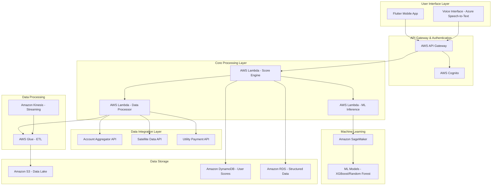
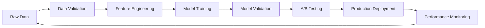

# Design Document

## Overview

GramScore AI MVP is a cloud-native, serverless credit scoring platform built on AWS infrastructure. The system integrates multiple data sources (UPI transactions, satellite imagery, utility payments, psychometric assessments) to generate behavior-based credit scores for rural Indian users. The architecture emphasizes scalability, security, and compliance with Indian data protection regulations.

## Architecture

### High-Level Architecture



### Component Architecture

The system follows a microservices architecture with the following key components:

1. **Frontend Layer**: Flutter mobile application with integrated voice interface
2. **API Layer**: AWS API Gateway for request routing and rate limiting
3. **Authentication**: AWS Cognito for user management and JWT token handling
4. **Processing Layer**: Serverless Lambda functions for business logic
5. **ML Layer**: SageMaker for model training and inference
6. **Data Layer**: Multi-tier storage strategy using S3, DynamoDB, and RDS

## Components and Interfaces

### 1. Mobile Application (Flutter)

**Purpose**: Primary user interface for data consent, voice interaction, and score display

**Key Features**:
- Multi-language support (Hindi, Marathi, English)
- Voice-to-text integration with Azure Speech Services
- Offline capability for basic functions
- Biometric authentication support

**Interfaces**:
- REST API calls to AWS API Gateway
- Azure Speech-to-Text API for voice processing
- Local storage for caching user preferences

### 2. Data Ingestion Service

**Purpose**: Orchestrates data collection from multiple sources

**Components**:
- **Account Aggregator Connector**: Retrieves UPI transaction history
- **Satellite Data Connector**: Fetches NDVI data from satellite providers
- **Utility Payment Connector**: Collects electricity and mobile bill payment history
- **Psychometric Processor**: Handles voice-based assessment responses

**Interfaces**:
```json
{
  "dataIngestionRequest": {
    "userId": "string",
    "consentToken": "string",
    "dataTypes": ["transactions", "satellite", "utilities", "psychometric"],
    "timeRange": {
      "startDate": "ISO8601",
      "endDate": "ISO8601"
    }
  }
}
```

### 3. Transaction Classification Engine

**Purpose**: Categorizes UPI transactions into business and personal flows

**ML Model**: Fine-tuned BERT model for transaction description classification

**Processing Logic**:
- Text preprocessing and normalization
- Feature extraction from transaction metadata
- Classification confidence scoring
- Manual review flagging for low-confidence predictions

**Output Schema**:
```json
{
  "transactionId": "string",
  "category": "business_inflow|personal_outflow|unknown",
  "confidence": "float",
  "amount": "decimal",
  "timestamp": "ISO8601",
  "merchantCategory": "string"
}
```

### 4. Satellite Data Processor

**Purpose**: Analyzes agricultural productivity using NDVI data

**Data Sources**:
- Sentinel-2 satellite imagery
- Landsat 8/9 data
- Indian Space Research Organisation (ISRO) data

**Processing Pipeline**:
1. Coordinate validation against land records
2. NDVI calculation and temporal analysis
3. Crop health assessment
4. Productivity scoring (0-100 scale)

### 5. GramScore Engine

**Purpose**: Core scoring algorithm that combines all data sources

**Scoring Components**:
- **Transaction Frequency (30%)**: Consistency and volume of digital transactions
- **Agricultural Productivity (30%)**: Satellite-derived crop health and yield indicators
- **Utility Bill Hygiene (20%)**: Payment timeliness and consistency
- **Repayment Intent (20%)**: Psychometric assessment results

**Algorithm**:
```python
def calculate_gramscore(transaction_score, agriculture_score, utility_score, psychometric_score):
    weighted_score = (
        transaction_score * 0.30 +
        agriculture_score * 0.30 +
        utility_score * 0.20 +
        psychometric_score * 0.20
    )
    # Normalize to 300-900 range
    return 300 + (weighted_score * 600)
```

### 6. Explainable AI Service

**Purpose**: Generates human-readable explanations for credit scores

**Features**:
- SHAP (SHapley Additive exPlanations) values for feature importance
- Natural language generation in local languages
- Actionable recommendations for score improvement
- Visual score breakdown components

**Output Format**:
```json
{
  "explanation": {
    "language": "hi|mr|en",
    "overallScore": 650,
    "components": [
      {
        "factor": "transaction_frequency",
        "impact": "+45",
        "explanation": "आपके नियमित UPI लेनदेन आपके स्कोर को बढ़ाते हैं"
      }
    ],
    "recommendations": [
      "अपने बिजली के बिल समय पर भरें"
    ]
  }
}
```

## Data Models

### Data Validation Framework

**Input Validation Rules**:
```json
{
  "transactionAmount": {
    "type": "decimal",
    "minimum": 0.01,
    "maximum": 1000000,
    "required": true
  },
  "coordinates": {
    "latitude": {"range": [6.0, 37.0]},
    "longitude": {"range": [68.0, 98.0]},
    "precision": 6
  },
  "phoneNumber": {
    "pattern": "^[6-9]\\d{9}$",
    "required": true
  }
}
```

**Data Quality Checks**:
- **Completeness**: Minimum 70% data completeness for score generation
- **Consistency**: Cross-validation between different data sources
- **Timeliness**: Data freshness requirements (max 90 days old)
- **Accuracy**: Statistical outlier detection and correction

### User Profile
```json
{
  "userId": "string",
  "personalInfo": {
    "name": "string",
    "phone": "string",
    "aadhaarHash": "string",
    "location": {
      "state": "string",
      "district": "string",
      "coordinates": {
        "latitude": "decimal",
        "longitude": "decimal"
      }
    }
  },
  "farmDetails": {
    "landSize": "decimal",
    "cropTypes": ["string"],
    "landRecordNumber": "string"
  },
  "consentStatus": {
    "dataTypes": ["string"],
    "consentTimestamp": "ISO8601",
    "expiryDate": "ISO8601"
  }
}
```

### Credit Score Record
```json
{
  "scoreId": "string",
  "userId": "string",
  "gramScore": "integer",
  "components": {
    "transactionScore": "decimal",
    "agricultureScore": "decimal",
    "utilityScore": "decimal",
    "psychometricScore": "decimal"
  },
  "dataQuality": {
    "completeness": "decimal",
    "recency": "integer",
    "reliability": "decimal"
  },
  "generatedAt": "ISO8601",
  "validUntil": "ISO8601"
}
```

### Transaction Data
```json
{
  "transactionId": "string",
  "userId": "string",
  "amount": "decimal",
  "type": "credit|debit",
  "category": "business_inflow|personal_outflow",
  "merchantInfo": {
    "name": "string",
    "category": "string",
    "location": "string"
  },
  "timestamp": "ISO8601",
  "paymentMethod": "UPI|card|cash"
}
```

## Error Handling

### Error Categories

1. **Data Availability Errors**
   - Insufficient transaction history
   - Satellite data unavailable
   - Utility payment records missing

2. **Processing Errors**
   - ML model inference failures
   - Data quality issues
   - API timeout errors

3. **Compliance Errors**
   - Consent expiry
   - Data residency violations
   - Privacy policy violations

### Error Response Strategy

```json
{
  "error": {
    "code": "INSUFFICIENT_DATA",
    "message": "कम से कम 3 महीने का लेनदेन इतिहास आवश्यक है",
    "severity": "warning|error|critical",
    "retryable": true,
    "recommendations": [
      "अधिक UPI लेनदेन करें",
      "30 दिन बाद पुनः प्रयास करें"
    ]
  }
}
```

### Fallback Mechanisms

1. **Partial Scoring**: Generate scores with available data and adjust confidence levels
2. **Alternative Data Sources**: Use mobile wallet data when UPI data is insufficient
3. **Manual Review Queue**: Flag complex cases for human assessment
4. **Graceful Degradation**: Provide basic services when ML models are unavailable

## Testing Strategy

### Unit Testing
- Individual Lambda function testing
- ML model accuracy validation
- Data transformation logic verification
- API endpoint response validation

### Integration Testing
- End-to-end data flow testing
- Third-party API integration testing
- Database consistency checks
- Authentication and authorization flows

### Performance Testing
- Load testing for 10,000 concurrent users
- Latency testing for 15-second score generation
- Stress testing during harvest season spikes
- Memory and CPU utilization monitoring

### Security Testing
- Penetration testing for API endpoints
- Data encryption validation
- Consent management workflow testing
- DPDP Act compliance verification

### User Acceptance Testing
- Voice interface accuracy testing with native speakers
- Multilingual content validation
- Accessibility testing for low-literacy users
- Field testing with 100 pilot farmers

### Monitoring and Observability

**Key Metrics**:
- API response times and error rates
- ML model prediction accuracy
- Data pipeline success rates
- User engagement and completion rates

**Alerting**:
- Real-time alerts for system failures
- Data quality degradation notifications
- Security incident automated responses
- Compliance violation alerts

**Logging Strategy**:
- Structured logging with correlation IDs
- Audit trails for all data access
- Performance metrics collection
- User behavior analytics (privacy-compliant)

## Security Architecture

### Authentication & Authorization
- **Multi-factor Authentication**: OTP + biometric for high-value operations
- **JWT Token Management**: Short-lived access tokens with refresh token rotation
- **Role-Based Access Control**: Granular permissions for users, lenders, and administrators
- **API Rate Limiting**: Configurable limits per user type and endpoint

### Data Protection
- **Encryption at Rest**: AES-256 encryption for all stored data
- **Encryption in Transit**: TLS 1.3 for all API communications
- **Key Management**: AWS KMS with automatic key rotation
- **Data Masking**: PII masking in logs and non-production environments

### Fraud Detection
- **Behavioral Analytics**: ML-based detection of unusual access patterns
- **Device Fingerprinting**: Track device characteristics for identity verification
- **Geolocation Validation**: Flag access from unexpected locations
- **Velocity Checks**: Monitor rapid successive requests from same user

## Disaster Recovery & Business Continuity

### Backup Strategy
- **Database Backups**: Automated daily backups with 30-day retention
- **Cross-Region Replication**: Real-time replication to secondary AWS region
- **Model Artifacts**: Versioned storage of all ML models and training data
- **Configuration Backups**: Infrastructure as Code with version control

### Recovery Procedures
- **RTO Target**: 4 hours for full system recovery
- **RPO Target**: 1 hour maximum data loss
- **Failover Automation**: Automated DNS switching to backup region
- **Data Consistency**: Eventual consistency with conflict resolution

## API Design & Versioning

### RESTful API Standards
```json
{
  "baseUrl": "https://api.gramscore.in/v1",
  "authentication": "Bearer JWT",
  "contentType": "application/json",
  "rateLimit": "1000 requests/hour per user"
}
```

### Versioning Strategy
- **URL Versioning**: `/v1/`, `/v2/` for major changes
- **Header Versioning**: `API-Version: 2024-02-14` for minor changes
- **Backward Compatibility**: Maintain previous version for 12 months
- **Deprecation Policy**: 6-month notice for breaking changes

### Caching Strategy
- **Application Cache**: Redis cluster for session data and frequent queries
- **CDN Caching**: CloudFront for static assets and API responses
- **Database Caching**: ElastiCache for frequently accessed user scores
- **Cache Invalidation**: Event-driven cache updates on data changes

## Model Management & MLOps

### Model Training Pipeline


### Model Governance
- **Version Control**: Git-based versioning for all model code and configurations
- **Experiment Tracking**: MLflow for tracking model experiments and metrics
- **Model Registry**: Centralized registry with approval workflows
- **Automated Testing**: Unit tests for model code and integration tests for pipelines

### Performance Monitoring
- **Model Drift Detection**: Statistical tests for feature and prediction drift
- **Data Quality Monitoring**: Automated checks for data completeness and consistency
- **Bias Detection**: Regular audits for demographic and geographic bias
- **Explainability Tracking**: Monitor explanation consistency and user feedback

## Compliance & Regulatory Framework

### DPDP Act 2023 Compliance
- **Consent Management**: Granular consent with clear purpose limitation
- **Data Minimization**: Collect only necessary data for credit assessment
- **Right to Erasure**: Automated data deletion within 30 days of request
- **Data Portability**: Export user data in machine-readable format
- **Breach Notification**: Automated alerts within 72 hours of detection

### RBI Guidelines Adherence
- **Fair Lending Practices**: Algorithmic bias testing and mitigation
- **Customer Grievance Redressal**: 24/7 support with escalation procedures
- **Data Localization**: All processing within Indian jurisdiction
- **Audit Trail**: Immutable logs for regulatory inspection

### International Standards
- **ISO 27001**: Information security management system certification
- **SOC 2 Type II**: Annual third-party security audits
- **GDPR Readiness**: Future-proofing for international expansion
- **Fair Credit Reporting**: Transparent scoring methodology disclosure